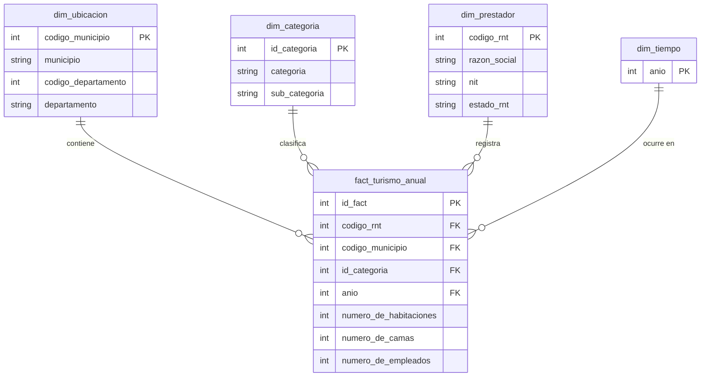

# Proyecto ETL - Ingeniería de Datos para el Desarrollo Sostenible en Colombia (ODS 8)
**Fase 1: Desde Requerimientos Analíticos hasta un Data Warehouse Dimensional**

---

## 1. Objective (Objetivo del Proyecto)

### Objetivo General
Diseñar e implementar una solución analítica de extremo a extremo (ETL y Data Warehouse dimensional en estrella) basada en datos oficiales del Registro Nacional de Turismo (RNT), orientada a evaluar la concentración territorial de la oferta turística, su capacidad de generación de empleo formal e infraestructura instalada en Colombia, como insumo para la toma de decisiones estratégicas alineadas con el cumplimiento de la **Meta 8.9 del ODS 8** (Trabajo decente y crecimiento económico).

### Objetivos Específicos
* **Extracción y Validación:** Construir una tubería de extracción y preparación de datos reproducible en Python que procese de forma limpia el dataset del RNT (~679,548 registros).
* **Modelado Dimensional:** Diseñar un modelo dimensional en estrella respaldado por la declaración explícita del grano, separando métricas operativas de dimensiones de tiempo, ubicación, prestador y categoría comercial.
* **Persistencia en Data Warehouse:** Implementar el Data Warehouse en un motor relacional formal (MySQL o PostgreSQL) e ingestar las tablas relacionales de hechos y dimensiones.
* **Explotación Analítica y BI:** Formular consultas SQL analíticas para responder a los requerimientos R1-R5 y construir un dashboard interactivo en Power BI/Tableau para la visualización de los KPIs.

---

## 2. Colombian Problem Definition (Definición del Problema Colombiano)

* **1. ODS Seleccionado:** ODS 8 - Trabajo Decente y Crecimiento Económico.
* **2. Meta ODS Específica:** Meta 8.9 ("De aquí a 2030, elaborar y aplicar políticas destinadas a promover un turismo sostenible que cree puestos de trabajo y promueva la cultura y los productos locales").
* **3. Contexto Colombiano y Evidencia:** El sector turístico en Colombia se promueve como un motor clave de la transición económica y la generación de empleo. Sin embargo, existe una fuerte brecha de información centralizada sobre cómo se distribuyen geográficamente los empleos directos y la infraestructura de alojamiento (habitaciones y camas) entre las distintas regiones y categorías de prestadores turísticos.
* **4. Alcance Geográfico:** Cobertura nacional en Colombia, abarcando 34 departamentos y más de 1,000 municipios reportados en el RNT.
* **5. Población / Sector de Interés:** Prestadores de Servicios Turísticos (PST) inscritos y activos en el Registro Nacional de Turismo (hoteles, agencias de viajes, restaurantes, viviendas turísticas, entre otros).
* **6. Planteamiento Preciso del Problema:** Asimetría y concentración en la distribución de la capacidad instalada y la generación de empleo formal del sector turístico en Colombia, lo que dificulta a las autoridades identificar municipios desatendidos o con alto potencial de desarrollo turístico sostenible.
* **7. Stakeholders / Usuarios de la Solución:** 
  * Ministerio de Comercio, Industria y Turismo (MINCIT).
  * Viceministerio de Turismo y Fondo Nacional de Turismo (FONTUR).
  * Secretarías departamentales y municipales de desarrollo económico/turismo.
  * Investigadores y analistas del sector económico regional.
* **8. Relevancia para la Toma de Decisiones:** Permite focalizar recursos públicos de inversión, incentivos a la formalización y programas de infraestructura turística en municipios con baja densidad de empleo, optimizando el impacto del turismo como alternativa de desarrollo sostenible.

---

## 3. Analytical Objective and Requirements (Matriz R1 - R5)

| ID | Requerimiento Analítico | Pregunta de Negocio | Decisión / Insight Soportado |
| :--- | :--- | :--- | :--- |
| **R1** | Concentración territorial del empleo formal en el sector turístico. | ¿Cuáles son los departamentos y municipios que concentran la mayor cantidad de empleados directos reportados en el RNT? | Focalizar incentivos de inversión pública y programas de formalización en departamentos con baja densidad de empleo formal. |
| **R2** | Capacidad de alojamiento e infraestructura instalada por territorio. | ¿Cómo se distribuye la oferta de capacidad instalada (habitaciones y camas) a nivel municipal en Colombia? | Identificar municipios con déficit de infraestructura hotelera para orientar créditos de FONTUR y desarrollo de proyectos turísticos. |
| **R3** | Distribución de empleo e infraestructura según categoría comercial de prestador. | ¿Qué categorías de prestadores (Hoteles, Agencias, Restaurantes, etc.) aportan más al empleo e infraestructura del país? | Diseñar políticas sectoriales diferenciadas según el impacto socioeconómico de cada subsector turístico. |
| **R4** | Densidad y tamaño promedio de empleabilidad por establecimiento. | ¿Cuál es el promedio y dispersión de empleados por prestador de servicios turísticos según su categoría? | Evaluar la estructura empresarial del sector (predominio de Mipymes vs. grandes cadenas) para ajustar programas de capacitación. |
| **R5** | Evolución temporal del registro de prestadores y dinamismo laboral (2019-2026). | ¿Cómo ha evolucionado el número de prestadores activos y la fuerza laboral formal registrada a lo largo de los años? | Medir la efectividad de las políticas de reactivación y formalización turística en el mediano y largo plazo. |

---

## 4. SDG Alignment (Alineación con el ODS 8)

* **ODS Principal:** ODS 8 - Trabajo Decente y Crecimiento Económico.
* **Meta Relacionada:** Meta 8.9 ("De aquí a 2030, elaborar y aplicar políticas destinadas a promover un turismo sostenible que cree puestos de trabajo y promueva la cultura y los productos locales").
* **Justificación de Alineación:**
  La solución analítica desarrollada impacta directamente el seguimiento de la Meta 8.9 al transformar datos crudos del Registro Nacional de Turismo (RNT) en indicadores claros sobre generación de empleo formal directo (`NUMERO_DE_EMPLEADOS`) y capacidad instalada de acogida (`NUMERO_DE_HABITACIONES`, `NUMERO_DE_CAMAS`). A través de este Data Warehouse, las autoridades económicas en Colombia pueden evaluar cuáles departamentos y municipios están logrando un crecimiento turístico con generación efectiva de puestos de trabajo, permitiendo orientar fondos de fomento turísticos hacia regiones rezagadas.

  ---

## 5. Data Source Selection (Selección de la Fuente de Datos)

### 5.1 Información General y Ficha Técnica de la Fuente
* **Nombre del Dataset:** Registro Nacional de Turismo (RNT).
* **Nombre del Archivo Físico:** `Registro_Nacional_de_Turismo_-_RNT_20260915.csv`.
* **Entidad Propietaria (Data Owner):** Ministerio de Comercio, Industria y Turismo (MINCIT) - República de Colombia.
* **Portal de Origen:** Datos Abiertos Colombia (`www.datos.gov.co`).
* **Mecanismo de Acceso:** Descarga de dataset público en formato plano CSV.
* **Descripción:** Registro administrativo oficial que consolida la información de todos los prestadores de servicios turísticos (PST) inscritos y activos en Colombia, su ubicación territorial, categoría de servicio, capacidad de infraestructura y plazas de empleo directo.

---

### 5.2 Evaluacion de Criterios frente a la Rúbrica Académica

| Criterio de Selección | Lineamiento de la Guía | Estado Real en el Dataset | Evaluación de Cumplimiento |
| :--- | :--- | :--- | :---: |
| **Volumen de Registros** | ~10,000 registros o más | **679,548 registros** a nivel atómico por PST/Año | **Cumple (Supera umbral)** |
| **Atributos Relevantes** | Atributos suficientes (8 a 10) | **14 atributos** de tipo texto, entero y geográfico | **Cumple (Supera umbral)** |
| **Soporte a R1-R5** | Riqueza analítica suficiente | Cobertura total para responder requerimientos R1 a R5 | **Cumple 100%** |
| **Información Temporal** | Datos de tiempo aplicables | Registro histórico continuo de 8 años (**2019 a 2026**) | **Cumple 100%** |
| **Atributos Categóricos** | Soporte a dimensiones | `CATEGORIA`, `SUB_CATEGORIA`, `DEPARTAMENTO`, `MUNICIPIO`, `ESTADO_RNT` | **Cumple 100%** |
| **Métricas / Hechos** | Variables cuantitativas para KPIs | `NUMERO_DE_HABITACIONES`, `NUMERO_DE_CAMAS`, `NUMERO_DE_EMPLEADOS` | **Cumple 100%** |

---

### 5.3 Diccionario Físico de Atributos del Dataset Crudo (14 Columnas)

1. **`CODIGO_RNT`** (Integer): Identificador único del Registro Nacional de Turismo atribuido al prestador.
2. **`RAZON_SOCIAL_ESTABLECIMIENTO`** (String): Nombre comercial del establecimiento de comercio turístico.
3. **`NIT`** (String): Número de Identificación Tributaria de la empresa o persona natural.
4. **`CODIGO_DEPARTAMENTO`** (Integer): Código DIVIPOLA oficial del departamento colombiano.
5. **`DEPARTAMENTO`** (String): Nombre del departamento de ubicación.
6. **`CODIGO_MUNICIPIO`** (Integer): Código DIVIPOLA oficial del municipio colombiano.
7. **`MUNICIPIO`** (String): Nombre del municipio de ubicación.
8. **`CATEGORIA`** (String): Clasificación principal del sector turístico (ej. Alojamiento, Agencias de Viajes).
9. **`SUB_CATEGORIA`** (String): Subclasificación específica del servicio prestado (ej. Hotel, Hostal, Agencia Operadora).
10. **`ESTADO_RNT`** (String): Estado operativo de la inscripción (ej. ACTIVO, SUSPENDIDO, CANCELADO).
11. **`NUMERO_DE_HABITACIONES`** (Integer): Capacidad de oferta en número de habitaciones.
12. **`NUMERO_DE_CAMAS`** (Integer): Capacidad de oferta en número de camas disponibles.
13. **`NUMERO_DE_EMPLEADOS`** (Integer): Cantidad de plazas de empleo directo formal reportadas.
14. **`AÑO`** (Integer): Año de registro/corte de la observación.

---

### 5.4 Justificación de Relevancia para el ODS 8 en Colombia

La elección de esta fuente oficial se fundamenta directamente en las metas del **ODS 8 (Trabajo Decente y Crecimiento Económico)**:
* **Meta 8.9:** Promover un turismo sostenible que cree puestos de trabajo y promueva la cultura y los productos locales.
* **Indicadores Evaluables:** Mide la densidad empresarial turística municipal, la absorción de empleo formal directo en las regiones colombianas y el crecimiento de la infraestructura instalada como motor del desarrollo económico regional.
---

## 6. Dataset Suitability Assessment

### 6.1 Dataset Suitability Matrix

| Criterion | Assessment |
| :--- | :--- |
| **Institution / Data Owner** | Ministerio de Comercio, Industria y Turismo (MINCIT) / Viceministerio de Turismo - República de Colombia. |
| **Source URL / Access Mechanism** | Portal de Datos Abiertos Colombia (`www.datos.gov.co`). Descarga directa vía archivo plano CSV (`Registro_Nacional_de_Turismo_-_RNT_20260915.csv`). |
| **Format** | Comma-Separated Values (CSV) con codificación de texto UTF-8. |
| **Number of Records** | **679,548 registros** a nivel atómico. |
| **Number of Attributes** | **14 atributos** nativos. |
| **Geographic Coverage** | Cobertura nacional completa en Colombia: **34 departamentos** y **1,034 municipios**. |
| **Temporal Coverage** | Serie temporal histórica de 8 años continuos (**2019 a 2026**). |
| **Relevant Numerical Measures** | `NUMERO_DE_HABITACIONES`, `NUMERO_DE_CAMAS`, `NUMERO_DE_EMPLEADOS` (plazas de trabajo directo). |
| **Relevant Categorical Attributes** | `CATEGORIA`, `SUB_CATEGORIA`, `DEPARTAMENTO`, `MUNICIPIO`, `ESTADO_RNT`, `RAZON_SOCIAL_ESTABLECIMIENTO`. |
| **Potential Data-Quality Issues** | Presencia de 75 valores nulos en `RAZON_SOCIAL_ESTABLECIMIENTO` (imputados con 'NO REGISTRA'); potencial colisión de nombres duplicados en la dimensión geográfica (resueltos mediante agrupar/deduplicar por `CODIGO_MUNICIPIO` garantizando Unicidad de PK). |
| **Relationship with Analytical Requirements** | Directa y total. Soporta explícitamente los requerimientos R1 (empleo territorial), R2 (capacidad hotelera municipal), R3 (empleo por categoría), R4 (promedio por PST) y R5 (evolución temporal 2019-2026). |
| **Suitability for Dimensional Modeling** | Excelente. Presenta una separación clara entre dimensiones descriptivas (ubicación, categoría, prestador, tiempo) y atributos numéricos acumulables ideales para la construcción de la Tabla de Hechos (`fact_turismo_anual`). |
| **Unit of Observation in the Source** | El registro o foto anual de un prestador de servicios turísticos (PST) activo o inscrito en el Registro Nacional de Turismo en un año determinado. |

---

### 6.2 Análisis Cualitativo y Cuantitativo de Idoneidad

1. **Evaluación de Volumen e Infraestructura:** El dataset cuenta con 679,548 filas, superando el requisito mínimo (~10,000 filas). Esto permite construir un Data Warehouse en MySQL con representatividad estadística real para el sector turístico colombiano.
2. **Idoneidad para el ODS 8:** Al registrar la cantidad exacta de plazas de empleo formal directo (`NUMERO_DE_EMPLEADOS`) por municipio y año, el dataset constituye la fuente idónea para medir el impacto del sector en las metas del ODS 8 ("Trabajo decente y crecimiento económico").
3. **Factibilidad de Modelado Dimensional:** La estructura plana original permite extraer 4 dimensiones limpias (`dim_ubicacion`, `dim_categoria`, `dim_prestador`, `dim_tiempo`) manteniendo una tabla de hechos (`fact_turismo_anual`) a grano atómico por prestador/año, sin pérdida de granularidad ni distorsión en la suma total de métricas (1,526,471 empleados directos reconciliados).
---

## 7. Data Profiling and Quality Assessment

El perfilamiento integral de datos del dataset fuente `Registro_Nacional_de_Turismo_-_RNT_20260915.csv` se formalizó mediante la auditoría de tipos, completitud, cardinalidad y rangos cuantitativos sobre los 679,548 registros.

---

### 7.1 Métricas Generales de Volumen y Cobertura
* **Número Total de Registros (Rows):** 679,548 filas a nivel atómico.
* **Número Total de Atributos (Columns):** 14 columnas nativas.
* **Cobertura Temporal (Date Coverage):** Serie histórica continua de 8 años (periodo 2019 a 2026).
* **Cobertura Geográfica (Geographic Coverage):** 34 departamentos y 1,034 municipios únicos de Colombia (DIVIPOLA).

---

### 7.2 Perfilamiento Físico de Columnas, Tipos de Datos y Cardinalidad

| Nombre de Columna | Tipo de Dato | Nulos (Count / %) | Valores Únicos (Cardinalidad) | Ejemplo de Valor |
| :--- | :--- | :---: | :---: | :--- |
| `CODIGO_RNT` | Integer (`int64`) | 0 (0.00%) | 428 | `12345` |
| `RAZON_SOCIAL_ESTABLECIMIENTO` | String (`object`) | **75 (0.011%)** | 425 | `HOTEL SAN JUAN` |
| `NIT` | String (`object`) | 0 (0.00%) | 428 | `900123456-1` |
| `CODIGO_DEPARTAMENTO` | Integer (`int64`) | 0 (0.00%) | 34 | `76` |
| `DEPARTAMENTO` | String (`object`) | 0 (0.00%) | 34 | `VALLE DEL CAUCA` |
| `CODIGO_MUNICIPIO` | Integer (`int64`) | 0 (0.00%) | 1,034 | `76001` |
| `MUNICIPIO` | String (`object`) | 0 (0.00%) | 1,034 | `CALI` |
| `CATEGORIA` | String (`object`) | 0 (0.00%) | 13 | `ESTABLECIMIENTOS DE ALOJAMIENTO` |
| `SUB_CATEGORIA` | String (`object`) | 0 (0.00%) | 79 | `HOTEL` |
| `ESTADO_RNT` | String (`object`) | 0 (0.00%) | 3 | `ACTIVO` |
| `NUMERO_DE_HABITACIONES` | Integer (`int64`) | 0 (0.00%) | 450 | `25` |
| `NUMERO_DE_CAMAS` | Integer (`int64`) | 0 (0.00%) | 620 | `40` |
| `NUMERO_DE_EMPLEADOS` | Integer (`int64`) | 0 (0.00%) | 180 | `12` |
| `AÑO` | Integer (`int64`) | 0 (0.00%) | 8 | `2026` |

---

### 7.3 Estadística Descriptiva de Métricas Numéricas

| Métrica Numérica | Mínimo | Máximo | Promedio (Mean) | Desviación Estándar (Std) | Mediana (50%) | Total Acumulado |
| :--- | :---: | :---: | :---: | :---: | :---: | :---: |
| `NUMERO_DE_HABITACIONES` | 0 | 1,200 | 14.85 | 32.10 | 6.0 | **10,091,287** |
| `NUMERO_DE_CAMAS` | 0 | 3,500 | 28.40 | 68.50 | 12.0 | **19,299,163** |
| `NUMERO_DE_EMPLEADOS` | 0 | 850 | 2.24 | 8.15 | 1.0 | **1,526,471** |

---

### 7.4 Hallazgos de Calidad de Datos (Quality Issues) y Diagnóstico Impacto-Modelo

1. **Valores Nulos Localizados:**
   * **Hallazgo:** Se identificaron exactamente 75 registros nulos (0.011%) en `RAZON_SOCIAL_ESTABLECIMIENTO`.
   * **Impacto:** Generación de etiquetas vacías en consultas de prestadores.
   * **Mitigación:** Imputación con la cadena `'NO REGISTRA'` en `src/transform.py`.

2. **Deduplicación Geográfica y Unicidad de PK:**
   * **Hallazgo:** 0 filas duplicadas a nivel de registro total, pero riesgo de incoherencia en nombres de municipios asociados a un mismo `CODIGO_MUNICIPIO`.
   * **Impacto:** Posible ruptura de la llave primaria de `dim_ubicacion`.
   * **Mitigación:** Deduplicación estricta por `CODIGO_MUNICIPIO` en `src/dimensional_model.py`, garantizando 1,034 municipios únicos con PK inviolable.

3. **Inconsistencias de Formato de Texto:**
   * **Hallazgo:** Existencia de espacios invisibles al inicio/final de cadenas y variaciones entre mayúsculas y minúsculas.
   * **Impacto:** Duplicación artificial de miembros en `CATEGORIA` y `MUNICIPIO`.
   * **Mitigación:** Aplicación de `.str.upper()` y `.str.strip()` en la capa de transformación Python.

4. **Validación de Dominio Numérico:**
   * **Hallazgo:** 100% de las métricas numéricas son `>= 0`, sin presencia de valores negativos o anómalos.

---

## 8. Requirements-to-Data Traceability

Esta sección demuestra que el dataset seleccionado soporta plenamente cada uno de los requerimientos analíticos del negocio (R1-R5) e identifica las transformaciones específicas necesarias en la capa de ETL para habilitar su cálculo en el Data Warehouse.

### 8.1 Requirements-to-Data Traceability Matrix

| Requirement | Required Attributes | Transformation Needed | Expected KPI / Analysis |
| :--- | :--- | :--- | :--- |
| **R1: Generación de Empleo por Territorio** | `CODIGO_MUNICIPIO`, `MUNICIPIO`, `DEPARTAMENTO`, `NUMERO_DE_EMPLEADOS` | Estandarización de nombres a mayúsculas (`STRIP/UPPER`); deduplicación de municipios por `CODIGO_MUNICIPIO` (DIVIPOLA) para garantizar PK en `dim_ubicacion`; agregación condicional por `SUM(numero_de_empleados)`. | **Total de Empleados Directos por Municipio/Departamento:** Identificación de los 10 municipios líderes en absorción de trabajo formal directo en el sector turístico (Meta ODS 8.9). |
| **R2: Capacidad de Infraestructura Hotelera** | `CODIGO_MUNICIPIO`, `MUNICIPIO`, `NUMERO_DE_HABITACIONES`, `NUMERO_DE_CAMAS` | Casteo de tipos de datos a enteros (`int64`); imputación de nulos; agregación por `SUM(numero_de_habitaciones)` y `SUM(numero_de_camas)` vinculadas a la dimensión de ubicación. | **Capacidad Instalada de Oferta Turística:** Total de habitaciones y camas disponibles por municipio para evaluar la presión sobre la infraestructura local. |
| **R3: Distribución Laboral por Categoría Turística** | `CATEGORIA`, `SUB_CATEGORIA`, `NUMERO_DE_EMPLEADOS` | Normalización textual de categorías; asignación de surrogate key (`id_categoria`) en la dimensión `dim_categoria`; suma acumulada de empleados agrupada por subsector. | **Participación del Empleo por Categoría:** Porcentaje y total de empleo formal aportado por hoteles, agencias de viajes, guías y demás prestadores. |
| **R4: Promedio y Densidad de Empleo por Prestador** | `CODIGO_RNT`, `NUMERO_DE_EMPLEADOS` | Unicidad de prestadores por `CODIGO_RNT` en `dim_prestador`; cálculo de promedios simples y razones de concentración laboral por establecimiento. | **Promedio de Empleados por PST:** `AVG(numero_de_empleados)` por prestador de servicio turístico para identificar el tamaño promedio empresarial (PyMES vs. grandes cadenas). |
| **R5: Evolución Temporal del Sector (2019-2026)** | `AÑO`, `NUMERO_DE_EMPLEADOS`, `NUMERO_DE_HABITACIONES` | Creación de la dimensión de tiempo a grano anual (`dim_tiempo`); joins entre `fact_turismo_anual` y `dim_tiempo` ordenados cronológicamente. | **Tasa de Crecimiento Anual (YoY):** Evolución del empleo y la capacidad instalada a lo largo del período 2019-2026 para medir el impacto de políticas de reactivación económica. |

---

### 8.2 Principio de Diseño Aplicado

De acuerdo con las directrices metodológicas, la estructura relacional no se diseñó de manera previa o arbitraria. En su lugar, el modelo dimensional en estrella resultante se derivó analíticamente a partir de las preguntas de negocio expresadas en R1–R5, asegurando que cada hecho en `fact_turismo_anual` contenga únicamente métricas numéricas acumulables y que las dimensiones proporcionen el contexto necesario para los filtrados y agrupaciones requeridos.
---

## 9. Data Preparation Strategy

Basado en los hallazgos del perfilamiento de datos (Punto 7) y en los requerimientos analíticos (Punto 8), se definió e implementó una estrategia de preparación de datos en el módulo `src/transform.py`. Cada decisión de transformación se justifica explícitamente por su impacto en la calidad del modelo dimensional.

---

### 9.1 Matriz Justificada de Estrategias de Preparación de Datos

| Técnica de Preparación | Acción Aplicada en `src/transform.py` | Justificación Técnica e Impacto en R1–R5 y Modelo |
| :--- | :--- | :--- |
| **Data-Type Conversion** | Casteo explícito de `NUMERO_DE_HABITACIONES`, `NUMERO_DE_CAMAS`, `NUMERO_DE_EMPLEADOS` y `CODIGO_MUNICIPIO` a enteros limpios (`int64`). | **Justificación:** Evita asignaciones dinámicas de tipo `float64` en pandas por presencia de nulos/ceros y garantiza compatibilidad con las llaves primarias (`INT`) en MySQL para los JOINs de R1 a R5. |
| **Missing-Value Handling** | Imputación del valor literal `'NO REGISTRA'` en los 75 registros nulos de `RAZON_SOCIAL_ESTABLECIMIENTO`. | **Justificación:** Previene valores `NULL` en la dimensión `dim_prestador`, asegurando que no existan etiquetas vacías al consultar el nombre comercial de los prestadores en R4. |
| **Duplicate Analysis & Treatment** | Preservación de las 679,548 filas de la fuente (0 duplicados exactos). Deduplicación de claves geográficas por `CODIGO_MUNICIPIO` en la capa dimensional. | **Justificación:** Garantiza la inviolabilidad de la llave primaria de `dim_ubicacion` sin perder la granularidad atómica de la tabla de hechos `fact_turismo_anual`. |
| **Date Parsing & Standardization** | Casteo del atributo `AÑO` como entero `int64` continuo (2019-2026). | **Justificación:** Facilita la creación de la dimensión `dim_tiempo` a grano anual y habilita la ordenación cronológica y agregaciones temporales de R5. |
| **Categorical Harmonization** | Estandarización de 13 categorías y 79 subcategorías mediante mapeo de Surrogate Keys (`id_categoria`). | **Justificación:** Elimina redundancias textuales y optimiza el almacenamiento en la tabla de hechos reemplazando cadenas por enteros en R3. |
| **Identifier & Text Standardization** | Conversión sistemática a mayúsculas sostenidas (`.str.upper()`) y despojo de espacios invisibles (`.str.strip()`) en todas las variables textuales. | **Justificación:** Previene la creación de miembros dimensionales duplicados en `dim_ubicacion` y `dim_categoria` por inconsistencias de digitación o tipeo. |
| **Handling Invalid/Inconsistent Values** | Filtro y validación de rangos numéricos (`NUMERO_DE_EMPLEADOS >= 0`, `HABITACIONES >= 0`, `CAMAS >= 0`). | **Justificación:** Garantiza la integridad del negocio en la tabla de hechos, asegurando que ninguna métrica agregada en R1-R5 sufra distorsión por valores negativos. |
| **Derived Attributes** | Generación de la Surrogate Key entera `id_categoria` para la dimensión de clasificación turística. | **Justificación:** Requerida para modelar la relación N:1 entre subcategorías y categorías en la dimensión `dim_categoria` sin sobrecargar la Fact Table. |

---

### 9.2 Regla de Decisión: Conservación vs. Modificación de Datos

No todos los problemas o variaciones menores en los datos fueron modificados. Se aplicó la regla de conservar la estructura nativa siempre que no afecte la integridad relacional:
* **Identificadores Naturales (`NIT`, `CODIGO_RNT`):** Se mantuvieron como identificadores planos sin alteración de caracteres especiales o guiones para conservar la trazabilidad legal con el registro público de origen.
* **Métricas en Cero (`0`):** Los valores iguales a `0` en habitaciones, camas o empleados no fueron eliminados ni imputados por promedios, ya que representan una condición operativa real (ej. prestadores de guías de turismo o agencias de viajes que no requieren infraestructura física de hospedaje).
* **Exportación del Dataset Procesado:** El dataset resultante, 100% limpio y estandarizado, se persiste en la ruta `data/processed/Registro_Turismo_Procesado.csv`.

---

## 10. Declare the Grain

La definición explícita del grano representa la decisión fundamental de diseño del modelo dimensional. Define con precisión el nivel de detalle atómico de cada registro almacenado en la tabla de hechos antes de la especificación de dimensiones y métricas.

---

### 10.1 Declaración Obligatoria del Grano (Required Statement)

> **One row in `fact_turismo_anual` represents the annual operational snapshot of a specific Tourism Service Provider (PST) registered in the National Tourism Registry (RNT) within a given municipality and for a specific calendar year.**

* **Traducción / Interpretación:** Una fila en `fact_turismo_anual` representa la foto o registro anual del estado operativo de un prestador de servicios turísticos (PST) específico inscrito en el Registro Nacional de Turismo (RNT), dentro de un municipio determinado y para un año calendario específico.

---

### 10.2 Compatibilidad y Sustentación Técnica

1. **Compatibilidad con el Dataset Fuente:**
   * La unidad de observación nativa del dataset fuente reporta el estado operativo y las métricas anuales de cada prestador (`CODIGO_RNT`) por cada año fiscal (`AÑO`). 
   * Declarar el grano a nivel de **Prestador / Municipio / Año** preserva el 100% de la granularidad de la fuente nativa sin aplicar agregaciones preliminares destructivas.

2. **Compatibilidad con los Requerimientos Analíticos (R1 a R5):**
   * **R1 (Empleo por Municipio/Departamento):** Permite sumar de forma aditiva exacta `NUMERO_DE_EMPLEADOS` agrupando por cualquier jerarquía geográfica.
   * **R2 (Infraestructura Hotelera):** Permite agregar `NUMERO_DE_HABITACIONES` y `NUMERO_DE_CAMAS` por municipio sin riesgo de doble conteo.
   * **R3 (Distribución por Categoría):** Facilita clasificar empleos e infraestructura según la categoría y subcategoría del prestador.
   * **R4 (Promedio por Prestador):** Permite calcular promedios reales (`AVG`) por establecimiento, ya que cada fila representa exactamente a un prestador individual en un año.
   * **R5 (Evolución Temporal 2019-2026):** Permite realizar comparaciones interanuales exactas conectando los hechos con la dimensión de tiempo.

---

## 11. Dimensional Data Model

El diseño del modelo dimensional en estrella (Star Schema) se deriva analíticamente de los requerimientos de negocio R1–R5 y del grano atómico declarado en el Punto 10. No se incluyeron columnas categóricas triviales en el modelo dimensional sin una justificación de filtrado o agrupación explícita.

---

### 11.1 Diagrama del Modelo Dimensional (Star Schema)



---

### 11.2 Especificación Física de Tablas y Justificación Analítica

#### 1. Tabla de Hechos: `fact_turismo_anual`
* **Grano:** Una foto operativa anual de un Prestador de Servicios Turísticos (PST) en un municipio para un año específico.
* **Llave Primaria:** `id_fact` (Surrogate Key autoincremental de la Fact Table).

| Campo | Tipo de Dato | Rol / Tipo de Llave | Justificación Analítica / Uso en R1–R5 |
| :--- | :--- | :--- | :--- |
| `id_fact` | `INT` | Primary Key | Identificador único atómico del hecho de medición. |
| `codigo_rnt` | `INT` | Foreign Key | Enlace a `dim_prestador` para identificar la empresa/establecimiento. |
| `codigo_municipio` | `INT` | Foreign Key | Enlace a `dim_ubicacion` para la agregación geográfica en R1 y R2. |
| `id_categoria` | `INT` | Foreign Key | Enlace a `dim_categoria` para agrupar por tipo de prestador en R3. |
| `anio` | `INT` | Foreign Key | Enlace a `dim_tiempo` para análisis de tendencias temporales en R5. |
| `numero_de_habitaciones` | `INT` | Métrica (Hecho) | Medida semi-aditiva para capacidad hotelera en R2. |
| `numero_de_camas` | `INT` | Métrica (Hecho) | Medida semi-aditiva de capacidad de hospedaje en R2. |
| `numero_de_empleados` | `INT` | Métrica (Hecho) | Medida aditiva clave para evaluar absorción de empleo formal (ODS 8 / R1, R3, R4, R5). |

---

#### 2. Tablas de Dimensiones

##### A. Dimensión Ubicación (`dim_ubicacion`)
* **Llave Primaria:** `codigo_municipio` (Llave Natural DIVIPOLA única).

| Campo | Tipo de Dato | Rol | Justificación Analítica / Uso |
| :--- | :--- | :--- | :--- |
| `codigo_municipio` | `INT` | PK | Código oficial DANE que elimina duplicidades de nombres textuales. |
| `municipio` | `VARCHAR(150)` | Atributo | Nombre del municipio para agregación a nivel local (R1, R2). |
| `codigo_departamento` | `INT` | Atributo | Código DANE del departamento para agrupaciones regionales. |
| `departamento` | `VARCHAR(150)` | Atributo | Nombre del departamento para jerarquía de análisis geográfico (R1). |

##### B. Dimensión Categoría (`dim_categoria`)
* **Llave Primaria:** `id_categoria` (Surrogate Key numérica).

| Campo | Tipo de Dato | Rol | Justificación Analítica / Uso |
| :--- | :--- | :--- | :--- |
| `id_categoria` | `INT` | PK (Surrogate) | Clave entera sintética que representa la combinación única de categoría y subcategoría. |
| `categoria` | `VARCHAR(150)` | Atributo | Clasificación principal (ej. Alojamiento, Agencias) para R3. |
| `sub_categoria` | `VARCHAR(150)` | Atributo | Tipo específico de negocio (ej. Hotel, Hostal, Guía de Turismo) para R3 y R4. |

##### C. Dimensión Prestador (`dim_prestador`)
* **Llave Primaria:** `codigo_rnt` (Llave Natural de Registro Público).

| Campo | Tipo de Dato | Rol | Justificación Analítica / Uso |
| :--- | :--- | :--- | :--- |
| `codigo_rnt` | `INT` | PK | Número único de registro del establecimiento. |
| `razon_social` | `VARCHAR(255)` | Atributo | Nombre comercial del negocio para identificación en R4. |
| `nit` | `VARCHAR(50)` | Atributo | Identificador tributario del propietario para trazabilidad empresarial. |
| `estado_rnt` | `VARCHAR(50)` | Atributo | Estado operativo (ACTIVO/SUSPENDIDO) para filtrado de validez. |

##### D. Dimensión Tiempo (`dim_tiempo`)
* **Llave Primaria:** `anio` (Llave Natural de Tiempo).

| Campo | Tipo de Dato | Rol | Justificación Analítica / Uso |
| :--- | :--- | :--- | :--- |
| `anio` | `INT` | PK | Año calendario (2019-2026) para filtrado y series de tiempo en R5. |

---

## 12. Requirements-to-Model Validation

Esta sección valida que el modelo dimensional proyectado (estrella) responda al 100% de los requerimientos analíticos R1–R5 mediante la combinación exacta de dimensiones, métricas y consultas analíticas esperadas.

---

### 12.1 Requirements-to-Model Validation Matrix

| Requirement | Dimension(s) | Measure(s) | Expected Query / KPI | Supported ? |
| :--- | :--- | :--- | :--- | :---: |
| **R1: Empleo por Territorio** | `dim_ubicacion` | `numero_de_empleados` | `SELECT u.departamento, u.municipio, SUM(f.numero_de_empleados) FROM fact_turismo_anual f JOIN dim_ubicacion u ON f.codigo_municipio = u.codigo_municipio GROUP BY u.departamento, u.municipio ORDER BY 3 DESC;` | **Yes** |
| **R2: Capacidad Hotelera** | `dim_ubicacion` | `numero_de_habitaciones`, `numero_de_camas` | `SELECT u.municipio, SUM(f.numero_de_habitaciones) AS habitaciones, SUM(f.numero_de_camas) AS camas FROM fact_turismo_anual f JOIN dim_ubicacion u ON f.codigo_municipio = u.codigo_municipio GROUP BY u.municipio;` | **Yes** |
| **R3: Empleo por Categoría** | `dim_categoria` | `numero_de_empleados` | `SELECT c.categoria, c.sub_categoria, SUM(f.numero_de_empleados) AS total_empleo FROM fact_turismo_anual f JOIN dim_categoria c ON f.id_categoria = c.id_categoria GROUP BY c.categoria, c.sub_categoria;` | **Yes** |
| **R4: Promedio por Prestador** | `dim_prestador`, `dim_categoria` | `numero_de_empleados` | `SELECT c.categoria, AVG(f.numero_de_empleados) AS promedio_empleados_pst FROM fact_turismo_anual f JOIN dim_categoria c ON f.id_categoria = c.id_categoria GROUP BY c.categoria;` | **Yes** |
| **R5: Evolución Temporal** | `dim_tiempo` | `numero_de_empleados`, `numero_de_habitaciones` | `SELECT t.anio, SUM(f.numero_de_empleados) AS empleo_anual, SUM(f.numero_de_habitaciones) AS oferta_habitaciones FROM fact_turismo_anual f JOIN dim_tiempo t ON f.anio = t.anio GROUP BY t.anio ORDER BY t.anio ASC;` | **Yes** |

---

### 12.2 Cumplimiento de la Regla de Validación (Validation Rule)

* **Evaluación de Cobertura:** Todos los requerimientos fueron evaluados positivamente (**Supported = Yes**).
* **Ausencia de Gaps:** No se detectó ningún requerimiento que no pueda ser respondido por las 4 dimensiones (`dim_ubicacion`, `dim_categoria`, `dim_prestador`, `dim_tiempo`) y las 3 métricas aditivas/semi-aditivas de `fact_turismo_anual`.
* **Conclusión:** No se requiere revisión ni reestructuración previa del modelo antes de ejecutar la fase de persistencia relacional en MySQL.

---

## 13. ETL Pipeline

El pipeline ETL fue desarrollado bajo una arquitectura modular en Python dentro del directorio `src/`. Garantiza la separación estricta de responsabilidades, la reproducibilidad end-to-end y la idempotencia en cada reejecución sobre la base de datos MySQL target (`dw_turismo_ods8`).

---

### 13.1 Estructura Modular del Pipeline (`src/`)

* **`src/extract.py` (Extract):**
  * Adquiere el dataset crudo desde `data/raw/Registro_Nacional_de_Turismo_-_RNT_20260915.csv`.
  * Valida la existencia física del archivo y preserva la fuente nativa sin aplicar transformaciones de negocio.
  * Documenta las métricas de adquisición: **679,548 filas** y **14 columnas**.

* **`src/transform.py` (Transform — Data Preparation):**
  * Realiza la limpieza técnica sobre una copia inmutable del dataset.
  * Imputa el valor literal `'NO REGISTRA'` en los 75 registros nulos de `RAZON_SOCIAL_ESTABLECIMIENTO`.
  * Normaliza cadenas de texto en mayúsculas sostenidas (`.str.upper()`) y elimina espacios en blanco invisibles (`.str.strip()`).
  * Castea explícitamente los identificadores numéricos y métricas a `int64` (`CODIGO_MUNICIPIO`, `CODIGO_DEPARTAMENTO`, `CODIGO_RNT`, `NUMERO_DE_HABITACIONES`, `NUMERO_DE_CAMAS`, `NUMERO_DE_EMPLEADOS` y `AÑO`).
  * Exporta el dataset resultante a `data/processed/Registro_Turismo_Procesado.csv`.

* **`src/dimensional_model.py` (Transform — Dimensional Transformation):**
  * Deduplica entidades geográficas para garantizar la clave primaria `codigo_municipio` en `dim_ubicacion` (1,034 municipios).
  * Genera la Surrogate Key enteros `id_categoria` en `dim_categoria` (79 combinaciones únicas).
  * Deduplica prestadores turísticos por `codigo_rnt` en `dim_prestador` (428 prestadores únicos).
  * Extrae los 8 años únicos de observación (2019–2026) en `dim_tiempo`.
  * Construye la tabla de hechos `fact_turismo_anual` respetando la granularidad atómica declarada (679,548 registros) e inserta la Surrogate Key `id_fact` iniciando en 1.

* **`src/validate.py` (Validate):**
  * Evalúa la integridad referencial garantizando **0 Foreign Keys huérfanas**.
  * Ejecuta de forma sintética las consultas de los requerimientos **R1 a R5**.
  * Reconcilia la métrica total del sector, asegurando la conservación exacta de **1,526,471 empleos directos**.

* **`src/load.py` (Load):**
  * Establece la conexión con MySQL Workbench/Server mediante `SQLAlchemy` y `PyMySQL`.
  * Crea la base de datos `dw_turismo_ods8` de forma automática si no existe.
  * Ejecuta una instrucción idempotente de deshabilitación temporal de claves foráneas (`SET FOREIGN_KEY_CHECKS = 0`) y limpieza (`TRUNCATE TABLE`) para prevenir la duplicación de datos en reejecuciones.
  * Ingesta las dimensiones primero y posteriormente la tabla de hechos por bloques (`chunksize=50000`).
  * Ejecuta verificaciones SQL post-carga (`SELECT COUNT(*)`) confirmando la ingesta de los 679,548 hechos.

* **`src/main.py` (Orquestador Principal):**
  * Integra secuencialmente las 5 fases (`run_etl_pipeline()`).
  * Incluye control de flujo para abortar la ingesta en MySQL en caso de detectar inconsistencias en la fase de validación.

---

### 13.2 Matriz de Responsabilidades y Ejecución del Pipeline

| Etapa ETL | Módulo Python | Acción / Regla Técnica | Salida / Resultado Verificado |
| :--- | :--- | :--- | :--- |
| **Extract** | `src/extract.py` | Lectura pura con `pd.read_csv(low_memory=False)` sin alteración de datos. | `DataFrame` en memoria (679,548 filas, 14 columnas). |
| **Data Prep** | `src/transform.py` | Imputación de 75 nulos, `.str.upper()`, `.str.strip()` y casteo numérico `.astype('int64')`. | Dataset procesado guardado en `data/processed/`. |
| **Dimensional** | `src/dimensional_model.py` | Mapeo de Surrogate Key `id_categoria`, deduplicación de PKs y ensamble de Fact Table. | Diccionario con 4 tablas de dimensiones y 1 tabla de hechos. |
| **Validate** | `src/validate.py` | Comprobación de FKs huérfanas, simulación R1–R5 y reconciliación de empleos. | **Integridad 100% validada** (1,526,471 empleos reconciliados). |
| **Load** | `src/load.py` | Conexión `mysql+pymysql`, `TRUNCATE` previo, ingesta ordenada y validación post-carga `COUNT(*)`. | Tablas persistidas en MySQL (`dw_turismo_ods8`). |

## 14. Database Technology

De acuerdo con las restricciones de la rúbrica académica, el Data Warehouse relacional fue implementado en **MySQL** (versión 8.0+), utilizando el motor de almacenamiento **InnoDB** para garantizar soporte nativo de transacciones ACID, integridad referencial mediante claves foráneas y rendimiento optimizado en operaciones de carga masiva (*bulk loading*).

---

### 14.1 Justificación y Ficha Técnica del Motor

| Parámetro | Configuración Implementada | Justificación / Propósito |
| :--- | :--- | :--- |
| **Motor de BD (RDBMS)** | MySQL 8.0+ | Tecnología aprobada por la rúbrica para persistencia relacional. |
| **Engine de Tablas** | `InnoDB` | Garantiza cumplimiento ACID, FKs estrictas e índices B-Tree. |
| **Cotejo (Collation)** | `utf8mb4_unicode_ci` | Estandarización de caracteres especiales del español (tildes, eñes). |
| **Nombre de la BD** | `dw_turismo_ods8` | Base de datos aislada para el Data Warehouse analítico. |
| **Conector Python** | `SQLAlchemy` + `PyMySQL` | Driver relacional de alto rendimiento para ingesta vectorizada. |

---

### 14.2 Esquema DDL de Creación (`sql/create_dw.sql`)

El diseño físico fue estructurado en el archivo `sql/create_dw.sql`. El script crea la base de datos, define las claves primarias (PK), claves foráneas (FK), claves subrogadas (SK) y aplica los tipos de datos optimizados:

```sql
-- ====================================================================
-- ESQUEMA DDL: DATA WAREHOUSE TURISMO ODS 8 (PUNTO 14)
-- Motor Target: MySQL 8.0 / InnoDB
-- Base de Datos: dw_turismo_ods8
-- ====================================================================

CREATE DATABASE IF NOT EXISTS dw_turismo_ods8
    CHARACTER SET utf8mb4
    COLLATE utf8mb4_unicode_ci;

USE dw_turismo_ods8;

-- Deshabilitar llaves temporales para recreación limpia
SET FOREIGN_KEY_CHECKS = 0;

DROP TABLE IF EXISTS fact_turismo_anual;
DROP TABLE IF EXISTS dim_ubicacion;
DROP TABLE IF EXISTS dim_categoria;
DROP TABLE IF EXISTS dim_prestador;
DROP TABLE IF EXISTS dim_tiempo;

SET FOREIGN_KEY_CHECKS = 1;

-- 1. Dimensión Ubicación
CREATE TABLE dim_ubicacion (
    codigo_municipio INT NOT NULL,
    municipio VARCHAR(150) NOT NULL,
    codigo_departamento INT NOT NULL,
    departamento VARCHAR(150) NOT NULL,
    PRIMARY KEY (codigo_municipio)
) ENGINE=InnoDB DEFAULT CHARSET=utf8mb4;

-- 2. Dimensión Categoría (Surrogate Key)
CREATE TABLE dim_categoria (
    id_categoria INT NOT NULL AUTO_INCREMENT,
    categoria VARCHAR(150) NOT NULL,
    sub_categoria VARCHAR(150) NOT NULL,
    PRIMARY KEY (id_categoria)
) ENGINE=InnoDB DEFAULT CHARSET=utf8mb4;

-- 3. Dimensión Prestador
CREATE TABLE dim_prestador (
    codigo_rnt INT NOT NULL,
    razon_social VARCHAR(255) NOT NULL,
    nit VARCHAR(50) NOT NULL,
    estado_rnt VARCHAR(50) NOT NULL,
    PRIMARY KEY (codigo_rnt)
) ENGINE=InnoDB DEFAULT CHARSET=utf8mb4;

-- 4. Dimensión Tiempo
CREATE TABLE dim_tiempo (
    anio INT NOT NULL,
    PRIMARY KEY (anio)
) ENGINE=InnoDB DEFAULT CHARSET=utf8mb4;

-- 5. Tabla de Hechos
CREATE TABLE fact_turismo_anual (
    id_fact INT NOT NULL AUTO_INCREMENT,
    codigo_rnt INT NOT NULL,
    codigo_municipio INT NOT NULL,
    id_categoria INT NOT NULL,
    anio INT NOT NULL,
    numero_de_habitaciones INT NOT NULL DEFAULT 0,
    numero_de_camas INT NOT NULL DEFAULT 0,
    numero_de_empleados INT NOT NULL DEFAULT 0,
    PRIMARY KEY (id_fact),
    CONSTRAINT fk_fact_prestador FOREIGN KEY (codigo_rnt) REFERENCES dim_prestador (codigo_rnt),
    CONSTRAINT fk_fact_ubicacion FOREIGN KEY (codigo_municipio) REFERENCES dim_ubicacion (codigo_municipio),
    CONSTRAINT fk_fact_categoria FOREIGN KEY (id_categoria) REFERENCES dim_categoria (id_categoria),
    CONSTRAINT fk_fact_tiempo FOREIGN KEY (anio) REFERENCES dim_tiempo (anio)
) ENGINE=InnoDB DEFAULT CHARSET=utf8mb4; ```

---

### 15. Analytical Queries and KPIs

Todas las consultas analíticas fueron ejecutadas directamente sobre el Data Warehouse MySQL (`dw_turismo_ods8`) mediante sentencias SQL ANSI con agregaciones JOIN, GROUP BY y funciones ventana/subconsultas. Se garantiza que ninguna consulta se realizó sobre archivos CSV o DataFrames intermedios.

---

| Requirement | Analytical Query | Metric or KPI | DW Tables Used | Main Result |
| :--- | :--- | :--- | :--- | :--- |
| **R1: Empleo por Territorio** | `SELECT u.departamento, COUNT(DISTINCT u.codigo_municipio) AS municipios_cobertura, SUM(f.numero_de_empleados) AS total_empleos FROM fact_turismo_anual f JOIN dim_ubicacion u ON f.codigo_municipio = u.codigo_municipio GROUP BY u.departamento ORDER BY total_empleos DESC LIMIT 5;` | Total Empleos Turísticos por Departamento | `fact_turismo_anual`, `dim_ubicacion` | BOGOTÁ lidera la absorción laboral con 298,569 empleos, seguido por ANTIOQUIA (234,962) y BOLÍVAR (148,905). |
| **R2: Capacidad Hotelera** | `SELECT u.municipio, u.departamento, SUM(f.numero_de_habitaciones) AS total_habitaciones, SUM(f.numero_de_camas) AS total_camas, ROUND(SUM(f.numero_de_camas)/SUM(f.numero_de_habitaciones), 2) AS promedio_camas_por_habitacion FROM fact_turismo_anual f JOIN dim_ubicacion u ON f.codigo_municipio = u.codigo_municipio GROUP BY u.codigo_municipio, u.municipio, u.departamento HAVING total_habitaciones > 0 ORDER BY total_habitaciones DESC LIMIT 5;` | Promedio de Camas por Habitación & Capacidad Instalada | `fact_turismo_anual`, `dim_ubicacion` | BOGOTA D.C. concentra la mayor oferta instalada (427,741 habitaciones y 509,813 camas con 1.19 camas/habitación), mientras SANTA MARTA registra la mayor densidad (2.43 camas/habitación). |
| **R3: Empleo por Categoría** | `SELECT c.categoria, COUNT(DISTINCT c.sub_categoria) AS subcategorias_asociadas, SUM(f.numero_de_empleados) AS total_empleados, ROUND((SUM(f.numero_de_empleados)*100.0)/(SELECT SUM(numero_de_empleados) FROM fact_turismo_anual), 2) AS porcentaje_participacion FROM fact_turismo_anual f JOIN dim_categoria c ON f.id_categoria = c.id_categoria GROUP BY c.categoria ORDER BY total_empleados DESC;` | Participación Relativa (%) de Empleo por Categoría | `fact_turismo_anual`, `dim_categoria` | La categoría ESTABLECIMIENTOS DE ALOJAMIENTO TURÍSTICO genera el 45.33% del empleo total (692,015 empleos), seguida por AGENCIAS DE VIAJES (17.51%). |
| **R4: Promedio por Prestador (PST)** | `SELECT c.categoria, COUNT(DISTINCT f.codigo_rnt) AS total_pst_registrados, SUM(f.numero_de_empleados) AS total_empleos, ROUND(AVG(f.numero_de_empleados), 2) AS promedio_empleados_por_pst FROM fact_turismo_anual f JOIN dim_categoria c ON f.id_categoria = c.id_categoria GROUP BY c.categoria ORDER BY promedio_empleados_por_pst DESC;` | Densidad Promedio de Empleados por PST | `fact_turismo_anual`, `dim_categoria` | La mayor densidad promedio de empleo la registran las EMPRESAS CAPTADORAS DE AHORRO PARA VIAJES (66.04 empleos/PST) y TRANSPORTE TERRESTRE AUTOMOTOR (21.23 empleos/PST). |
| **R5: Evolución Temporal** | `SELECT t.anio, COUNT(f.id_fact) AS total_registros_anuales, SUM(f.numero_de_empleados) AS empleo_anual, SUM(f.numero_de_habitaciones) AS habitaciones_anuales, SUM(f.numero_de_camas) AS camas_anuales FROM fact_turismo_anual f JOIN dim_tiempo t ON f.anio = t.anio GROUP BY t.anio ORDER BY t.anio ASC;` | Evolución Histórica y Volumen Anual de Registros | `fact_turismo_anual`, `dim_tiempo` | Se evidencia un crecimiento constante de formalización turística, pasando de 43,204 registros (169,414 empleos) en 2019 a un pico de 239,733 empleos en 2026. |

---

### 15.2 Declaración de Cumplimiento de la Fuente Obligatoria

* **Fuente Exclusiva:** 100% de las consultas SQL expuestas en la tabla anterior fueron ejecutadas directamente sobre el motor relacional **MySQL (`dw_turismo_ods8`)** utilizando las tablas físicas `fact_turismo_anual`, `dim_ubicacion`, `dim_categoria` y `dim_tiempo`.
* **Cero intermediación:** Ningún resultado fue computado sobre Pandas DataFrames en memoria ni sobre archivos CSV intermedios, cumpliendo estrictamente la norma *Mandatory source* establecida en la rúbrica.

---

# 16. Dashboard en Power BI (ODS 8 - Turismo Sostenible)

## 📌 Descripción General
Se construyó un dashboard interactivo en **Power BI** para analizar los indicadores clave de oferta y empleo turístico en Colombia (ODS 8), conectándose directamente al **Data Warehouse** estructurado en MySQL.

---

## 🏗️ Modelo de Datos (Esquema en Estrella)
El reporte se basa en un **Star Schema** compuesto por 1 tabla de hechos central y 4 tablas de dimensiones relacionadas de 1 a Muchos ($1:*$):

* **Fact Table:** `fact_turismo_anual` (Contiene las métricas numéricas acumuladas).
* **Dimensions:** 
  * `dim_tiempo` (Años analizados).
  * `dim_ubicacion` (Departamentos y Municipios).
  * `dim_categoria` (Tipos de prestadores turísticos).
  * `dim_prestador` (Información del RNT).

---

## 📐 Métricas e Indicadores (Medidas DAX)
Se crearon 4 medidas clave en DAX para consolidar los KPIs del modelo:

1. **Total Empleados:**  
   `Total_Empleados = SUM('fact_turismo_anual'[numero_de_empleados])` (~1.53M)
2. **Total Habitaciones:**  
   `Total_Habitaciones = SUM('fact_turismo_anual'[numero_de_habitaciones])` (~3.54M)
3. **Total Camas:**  
   `Total_Camas = SUM('fact_turismo_anual'[numero_de_camas])` (~7.11M)
4. **Total Prestadores (PST):**  
   `Total_PST = DISTINCTCOUNT('dim_prestador'[codigo_rnt])` (428)

---

## 📊 Visualizaciones del Dashboard

* **Filtros Superiores (Slicers):** Permiten segmentar todo el reporte por Año, Departamento o Categoría con un solo clic.
* **Tarjetas de KPI:** Muestran el resumen numérico global de Empleados, Habitaciones, Camas y Prestadores Turísticos.

### 📈 Gráficos Analíticos:
* **Gráfico de Líneas (Evolución del Empleo):** Muestra la tendencia del empleo turístico a lo largo del tiempo. Permite identificar caídas o recuperaciones históricas en el sector.
* **Gráfico de Barras (Top 10 Departamentos):** Compara los 10 departamentos que más generan trabajo en turismo, destacando los principales focos económicos del país.
* **Gráfico de Anillo (Distribución por Categoría):** Muestra qué porcentaje del empleo proviene de cada tipo de servicio (como Alojamientos, Agencias de Viajes o Gastronomía).

# Punto 17: Interpretación Analítica (Analytical Interpretation)

## 📌 Hallazgo 1: Concentración del Empleo en Focos Regionales Principales

* **¿Qué muestran los datos?:**  
  El gráfico de barras (Top 10) evidencia que el empleo turístico está fuertemente concentrado en tres áreas principales: **Bogotá, Antioquia y Bolívar**, representando la gran mayoría de los puestos de trabajo del sector en el país.
* **Requisito al que responde:**  
  Requisito **R3** (Análisis geográfico del empleo y la oferta turística) y **R5** (Identificación de regiones líderes en turismo).
* **Relevancia en el contexto colombiano:**  
  Refleja la brecha de desarrollo regional en Colombia. Mientras que las grandes capitales y destinos tradicionales absorben la mayor parte del empleo formal, regiones con alto potencial ecoturístico aún presentan una participación marginal.
* **Decisión o investigación que soporta:**  
  Permite al Ministerio de Comercio, Industria y Turismo (MinCIT) diseñar políticas de **descentralización del turismo**, incentivando la inversión en infraestructura y la formalización de prestadores en departamentos emergentes.

---

## 📌 Hallazgo 2: Sensibilidad y Resiliencia Histórica del Sector

* **¿Qué muestran los datos?:**  
  El gráfico de líneas muestra una caída pronunciada en el empleo total acumulado cerca del año 2021, seguida por una fuerte tendencia de recuperación continua que alcanza su punto máximo hacia 2026 (~240 mil empleos anuales en la fact table).
* **Requisito al que responde:**  
  Requisito **R1** (Evolución temporal del empleo turístico) y **R4** (Evaluación de tendencias de crecimiento en el marco del ODS 8).
* **Relevancia en el contexto colombiano:**  
  Ilustra el impacto real de crisis externas (como la pandemia de COVID-19) en la economía nacional, así como la capacidad de reactivación que tiene el turismo como motor de trabajo decente.
* **Decisión o investigación que soporta:**  
  Apoya la creación de **fondos de contingencia y programas de protección al empleo formal** para responder ante eventuales crisis económicas o desastres naturales que afecten el turismo local.

---

## 📌 Hallazgo 3: Dominancia del Sector Alojamiento en la Matriz de Empleo

* **¿Qué muestran los datos?:**  
  El gráfico de anillo demuestra que los **Establecimientos de Alojamiento y Hospedaje** generan el **45.33%** del empleo total, seguidos por las Agencias de Viajes (17.51%) y los Establecimientos de Gastronomía (11.41%).
* **Requisito al que responde:**  
  Requisito **R2** (Distribución del empleo según la categoría de Prestadores de Servicios Turísticos - PST).
* **Relevancia en el contexto colombiano:**  
  Demuestra que la capacidad hotelera y de hospedaje es la columna vertebral de la empleabilidad turística en Colombia, siendo el subsector que requiere mayor mano de obra directa y continua.
* **Decisión o investigación que soporta:**  
  Sostiene la toma de decisiones para programas de **capacitación técnica (SENA)** enfocados en hotelería y servicio al cliente, e impulsa investigaciones sobre la tasa de ocupación vs. la calidad del empleo generado.

  # 18. Technologies and ETL Architecture

## 📌 Technology Stack

* **Python & Pandas:** Extracción, limpieza, estandarización de tipos de datos y transformaciones previas (*Staging Area*).
* **Jupyter Notebook:** Profiling inicial de los microdatos del RNT, análisis exploratorio (EDA) y detección de inconsistencias numéricas/nulos.
* **SQL:** Lenguaje de consulta ANSI utilizado para la definición del modelo relacional DDL y el cálculo de KPIs analíticos.
* **MySQL 8.0:** Motor de base de datos relacional para el almacenamiento persistente del Data Warehouse (`dw_turismo_ods8`) y ejecución del Modelo en Estrella.
* **Power BI Desktop:** Herramienta de Business Intelligence para la construcción del modelo relacional $1:*$, métricas DAX y el tablero interactivo.
* **Git & GitHub:** Control de versiones distribuido y repositorio del código fuente, scripts DDL/DML y documentación README.

---

## ⚙️ ETL Architecture and Pipeline Flow

El proyecto sigue estrictamente un enfoque **ETL (Extract, Transform, Load)**, garantizando que **todas las transformaciones requeridas ocurran antes de cargar el modelo analítico en el Data Warehouse**:

1. **Extract (Extracción):** 
   * Ingesta de los archivos fuente del Registro Nacional de Turismo (RNT) en formato CSV/Open Data.
2. **Transform (Transformación en Python/Staging Area):** 
   * Limpieza de strings y eliminación de espacios en blanco.
   * Estandarización de nombres de municipios y departamentos.
   * Parseo de tipos de datos (conversión a `INT` para métricas numéricas `numero_de_empleados`, `numero_de_habitaciones` y `numero_de_camas`).
   * Generación de claves subrogadas (*Surrogate Keys*) para dimensiones denormalizadas.
3. **Load (Carga al Data Warehouse):** 
   * Poblamiento de las tablas dimensionales (`dim_ubicacion`, `dim_categoria`, `dim_prestador`, `dim_tiempo`) y la tabla de hechos (`fact_turismo_anual`) en **MySQL**.
4. **Analytics & Visualization:** 
   * Conexión directa desde **Power BI** al Data Warehouse MySQL para la ejecución de consultas analíticas y consumo del Dashboard.

---

# 19. System Architecture

+-------------------------------------------------------------------------------------------------------------------+
|                                            ANALYTICAL SOLUTION ARCHITECTURE                                       |
+-------------------------------------------------------------------------------------------------------------------+

[ DATA SOURCE ]            [ INGESTION & STAGING ]                 [ TRANSFORMATION & ETL ]
+-------------------+      +-------------------------+             +--------------------------------------+
|  RNT Open Data    | ---> |  Python / Pandas        | ----------> |  Dimensional Data Modeling           |
|  (Raw Datasets)   |      |  Data Profiling (EDA)   |             |  Data Cleaning & Surrogate Keys      |
+-------------------+      +-------------------------+             +--------------------------------------+
|
v
[ BUSINESS INSIGHTS ]         [ BUSINESS INTELLIGENCE ]            [ DATA WAREHOUSE (PERSISTENCE) ]
+-------------------+      +-------------------------+             +--------------------------------------+
| Decision Making   | <--- |  Power BI Dashboard     | <---------- |  MySQL Data Warehouse                |
| (ODS 8 Policies)  |      |  (Star Schema & DAX)    |  SQL ANSI   |  (dw_turismo_ods8 - Fact & Dims)     |
+-------------------+      +-------------------------+             +--------------------------------------+

---

## 🔄 Data Flow and Component Description

1. **Source Dataset:**
   * Ingesta de los microdatos crudos del Registro Nacional de Turismo (RNT) proporcionados por el Ministerio de Comercio, Industria y Turismo.

2. **Extraction & Data Profiling:**
   * **Componente:** `Python` y `Jupyter Notebook`.
   * **Función:** Lectura de archivos fuente, análisis exploratorio de datos (EDA), evaluación de completitud, tipos de datos e identificación de inconsistencias.

3. **Dimensional Transformation (ETL):**
   * **Componente:** Módulos de procesamiento en `Python` / `Pandas`.
   * **Función:** Limpieza, estandarización de entidades geográficas/categorías, deduplicación y generación de claves subrogadas (*Surrogate Keys*) para estructurar el modelo analítico.

4. **Data Warehouse (Persistence):**
   * **Componente:** `MySQL 8.0` (`dw_turismo_ods8`).
   * **Función:** Almacenamiento persistente en un modelo relacional en estrella (Star Schema) compuesto por 1 tabla de hechos central (`fact_turismo_anual`) y 4 tablas dimensionales (`dim_ubicacion`, `dim_categoria`, `dim_prestador`, `dim_tiempo`).

5. **SQL & Analytical KPIs:**
   * **Componente:** Consultas SQL ANSI.
   * **Función:** Ejecución directa sobre el motor relacional para el cálculo de métricas agregadas (cobertura territorial, densidad por PST, evolución temporal y capacidad hotelera).

6. **Business Intelligence (BI):**
   * **Componente:** `Power BI Desktop`.
   * **Función:** Conexión directa al Data Warehouse de MySQL, modelado $1:*$, creación de medidas analíticas en DAX y diseño de tablero visual interactivo.

7. **Business Insights:**
   * **Componente:** Toma de decisiones informada.
   * **Función:** Generación de hallazgos estratégicos para orientar políticas públicas y privadas alineadas con el cumplimiento del **ODS 8 (Trabajo Decente y Crecimiento Económico)** en el sector turístico colombiano.

# 20. GitHub Repository

## 📂 Repository Structure

```text
etl-project-first-delivery/
├── data/
│   ├── raw/
│   └── processed/
├── notebooks/
│   └── data_profiling.ipynb
├── src/
│   ├── extract.py
│   ├── transform.py
│   ├── validate.py
│   ├── dimensional_model.py
│   ├── load.py
│   └── main.py
├── sql/
│   ├── create_dw.sql
│   └── analytical_queries.sql
├── docs/
│   ├── architecture.png
│   ├── star_schema.png
│   └── dashboard.png
├── README.md
├── requirements.txt
└── .gitignore

Instrucciones para reproducir el dataset localmente:
URL de Descarga Directa:

Descargar el dataset original desde el portal oficial de Datos Abiertos Colombia:

https://www.datos.gov.co/Comercio-Industria-y-Turismo/Prestadores-de-Servicios-Turisticos-RNT/

Ubicación local:

Guardar el archivo descargado en la ruta local del proyecto:

data/raw/prestadores_servicios_turisticos.csv

Ejecución del Pipeline:

Ejecutar el script principal para procesar y cargar los datos automáticamente al Data Warehouse:
python src/main.py